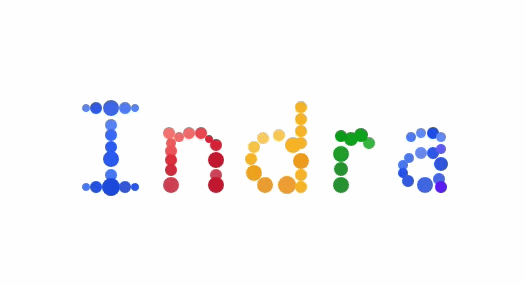

# Hi, I'm Indra M Jha 👋

*`// building backends & apps from Bihar, India`*

 

---

## About Me

Full-stack developer who enjoys building things that work well on both ends — a clean **Django backend** and a smooth **Android app** experience.

- 🐍 I build web apps and REST APIs with **Django & Python**
- 📱 I craft native **Android** apps in **Kotlin & Java**
- 📍 Based in **Bihar, India**

---

## 🛠 Tech Stack

**Backend**

**Mobile**

**Frontend & Tools**

---

## ⚡ Featured — Jumping Balls

> A creative remix of Google's iconic bouncing ball doodle, built with vanilla JavaScript.

Each coloured ball bounces and responds to interaction — physics-driven, no libraries, just raw JS.  
🔗 **[Try it live →](https://indramjha.blogspot.com/2012/05/jumping-balls.html)**

|---|---|---|
| 💡 Inspired by | [Google Balls Doodle](http://rawkes.com/lab/google-balls-logo) |  |
| 🔧 Built with | Vanilla JavaScript, DOM physics | 
| 📅 Year | 2012 | 

---

## 📦 What I Build

| Domain | Stack | Description |
|--------|-------|-------------|
| 🌐 Web Backend | Django · DRF · Python | REST APIs, auth systems, admin dashboards |
| 📱 Mobile | Android · Kotlin · Java | Native apps with MVVM, Jetpack, Retrofit |
| 🎨 Creative | JavaScript · HTML · CSS | Browser experiments & animations |

---

## 📊 GitHub Stats

---

*`// fun fact: I made balls jump on screen before it was cool 🎱`*

